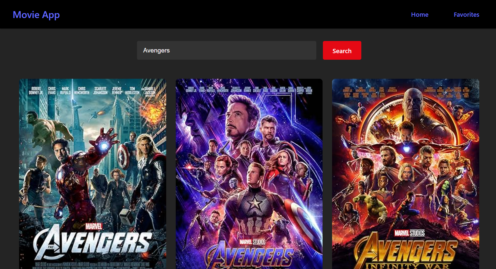

### 🎬 **Movie App Dashboard** 🎬

The **Movie App Dashboard** is an interactive web application designed to help users discover and track their favorite movies. Built with **React**, this app allows users to search for movies, save their favorites, and access movie details in an intuitive dashboard interface. By using **APIs** to fetch real-time movie data and leveraging **localStorage** for persistent data, this app provides a seamless and personalized movie discovery experience.

---

### 🌟 **Key Features** 🌟

- **Movie Search**:
   - The app integrates with **public movie APIs** to allow users to search for movies by title, genre, or actor. The search results are dynamically updated in real-time, providing users with instant access to movie details.
   
- **Favorite Movies**:
   - Users can mark their favorite movies, and these selections are saved using **localStorage**. This allows users to access their list of favorite movies anytime they return to the app, even after refreshing the page.

- **Movie Details**:
   - For each movie, the app fetches comprehensive details, including the movie’s release year, director, cast, rating, and more. This information is displayed in an easy-to-read format, helping users make informed decisions about which movies to watch.

- **Responsive Dashboard**:
   - The user interface is designed to be fully responsive, ensuring the app works seamlessly on both desktop and mobile devices. Whether browsing movies at home or on-the-go, users will enjoy a smooth experience across all screen sizes.

---

### 🚀 **How It Works** 🚀

1. **Movie Search**:
   - Users can search for movies by typing a keyword (e.g., title, genre, actor) in the search bar. The app sends the query to an API, fetches relevant results, and displays them in a grid or list format.
   - Each movie display includes a brief description, poster image, and rating, with an option to view more details.

2. **Saving Favorites**:
   - Users can click a “heart” icon next to each movie to add it to their **Favorites** list.
   - Movies are saved in the browser's **localStorage**, ensuring that the favorites list is persistent even when the page is refreshed or the app is revisited at a later time.

3. **View Favorite Movies**:
   - Users can access their **Favorite Movies** through a separate section of the dashboard, where all previously saved movies are displayed.
   - The app uses **localStorage** to load and display these movies when the user returns.

4. **Responsive Layout**:
   - The **dashboard** adjusts automatically to the screen size, ensuring a fluid layout on both desktop and mobile devices. This is achieved using **CSS media queries** and React’s state management to adjust content presentation.

---

### 🛠️ **Technologies Used** 🛠️

- **React**:
   - Built using **React** for its component-based architecture, allowing for easy state management and rendering of dynamic content like search results and movie details.
   
- **Movie APIs**:
   - The app fetches real-time movie data from **public movie APIs** (e.g., The Movie Database API, OMDB API) to ensure up-to-date movie information.
   
- **localStorage**:
   - **localStorage** is used to store users' favorite movies. This ensures that the movies remain saved even after the browser is refreshed, providing a persistent user experience.

- **CSS & Responsive Design**:
   - The app is designed with a **responsive layout** using **CSS Grid** and **Flexbox**, allowing the dashboard to adapt to different screen sizes and devices.

---

### 🎯 **Why Use the Movie App Dashboard?** 🎯

- **Instant Movie Search**: Quickly search for movies by title, genre, or actor and get real-time search results from APIs.
  
- **Track Favorite Movies**: Save and revisit your favorite movies anytime with persistent data storage using **localStorage**.
  
- **Movie Details at Your Fingertips**: View detailed information about each movie, including ratings, release year, director, and cast.

- **Responsive Interface**: Enjoy a smooth experience whether you’re on a desktop, tablet, or mobile device, with a responsive layout that adjusts seamlessly.

---

### 🌟 **Performance Enhancements & Results** 🌟

- **Real-time Search**: The app ensures that movie searches are fast and dynamic, providing results almost instantly after typing the search term.
  
- **Favorites Persistence**: By using **localStorage**, user preferences are retained between sessions, allowing them to quickly access their list of favorite movies even after a page refresh or app revisit.
  
- **Seamless Navigation**: The intuitive design and fast search results make it easy to navigate between the main movie list and the favorite movie list, enhancing overall user experience.

---

### 🏆 **Key Improvements & Achievements** 🏆

- **Movie Search & API Integration**:
   - The integration with **movie APIs** enables the app to provide up-to-date movie data, including details such as movie posters, release years, ratings, and cast, ensuring the user always has access to the latest information.

- **Persistent Favorites**:
   - **localStorage** allows users to keep track of their favorite movies without requiring a login, ensuring that their preferences are saved across sessions. 

- **Optimized User Interface**:
   - The user interface was designed with usability in mind, ensuring that users can easily search for, explore, and save movies. The layout is responsive, ensuring accessibility on all devices.

---

### 💡 **Future Improvements** 💡

- **User Authentication**: 
   - Adding **user authentication** (via Firebase or Auth0) could enable users to save their favorites across multiple devices and synchronize their preferences.
  
- **Additional Movie Categories**:
   - Introducing categories like **Top Rated**, **Trending Now**, and **Upcoming Movies** could provide more personalized options for users to discover new films.
  
- **Movie Recommendations**:
   - By implementing a recommendation engine based on users' favorite movies, the app could suggest films similar to the ones the user has already marked as favorites.

---

### 💬 **Get Started Today!** 💬

The **Movie App Dashboard** offers an intuitive, interactive platform for movie lovers to discover and save their favorite films. Whether you're a casual viewer looking to explore new releases or a movie enthusiast wanting to keep track of your must-watch list, this app is the perfect companion.

Start using the **Movie App Dashboard** today and experience seamless **movie search**, **persistent favorites**, and a **responsive, user-friendly interface** that will keep you coming back for more!

A big thank you to TechWithTim for their invaluable help and guidance throughout the development of this app. Your support has been greatly appreciated!

